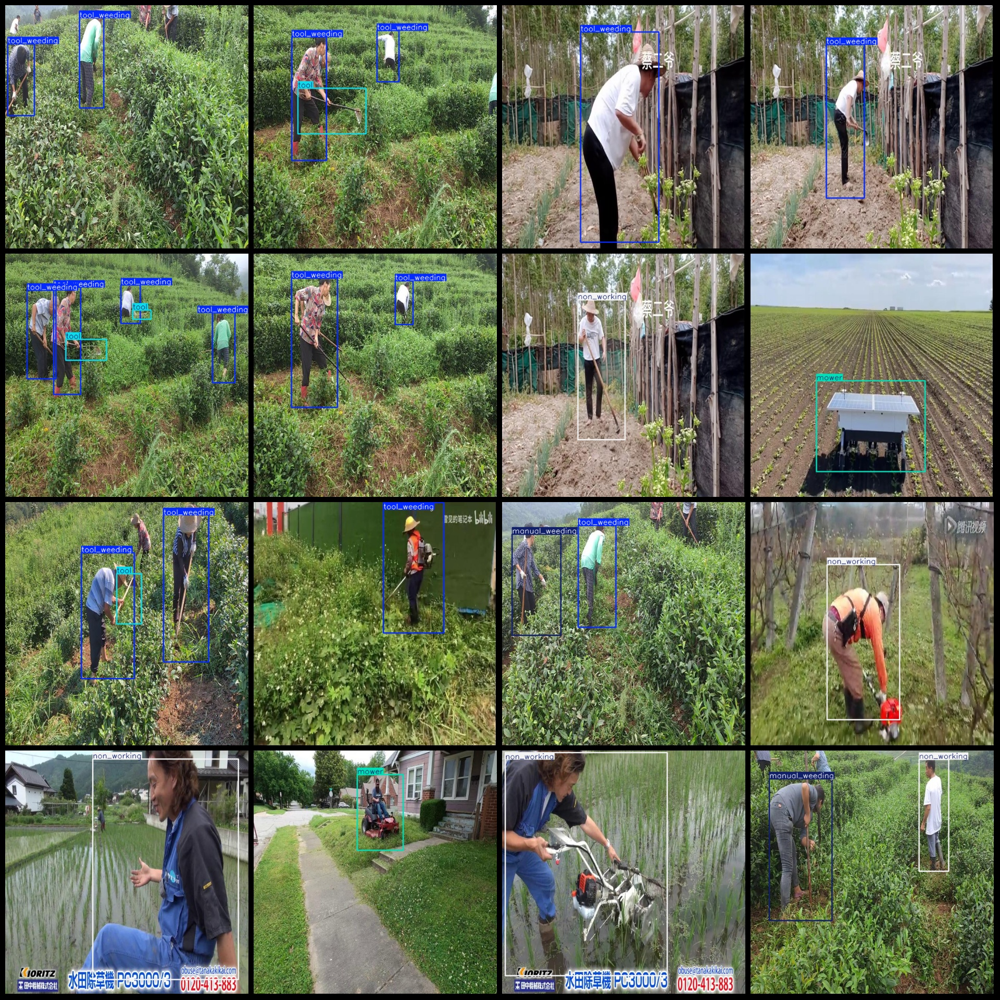
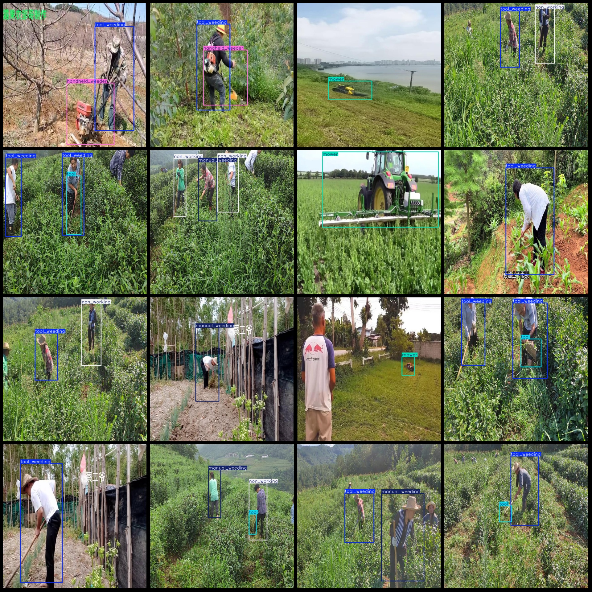

# Dataset for Detecting Grass Cutting Work in Labor

Dataset format: Pascal VOC format + YOLO format (txt file without split path, only containing jpg images and corresponding VOC format xml files and YOLO format txt files)
Number of images (jpg file count): 6064
Number of annotations (xml file count): 6064
Number of annotations (txt file count): 6064
Number of annotation categories: 6
Annotation category names (notice the order of categories in YOLO format does not correspond with this, but according to the labels folder classes.txt): ["handheld_weeder", "manual_weeding", "mower", "non_working", "tool", "tool_weeding"]
Each category of annotations:
- handheld_weeder = 566
- manual_weeding = 919
- mower = 1357
- non_working = 1358
- tool = 768
- tool_weeding = 5661
Total boxes: 10629
Number of images per category:
Handheld weeder has 566 images.
Manual weeding has 800 images.
Mower has 1351 images.
Non-working has 1218 images.
Tool has 695 images.
Tool weeding has 3970 images.
Image resolution: 640x640
Use the labeling tool: labelImg.
Markup Rules: Draw a square around the category.
Important Note: The dataset does not have splits for training, validation, and testing.
Special Notice: This dataset does not guarantee the accuracy of the trained model or weight files.
Preview of the image:
## Images

Here is a pay link on Stripe ( https://buy.stripe.com/3cs8yP7sY87d0vu9AB ). Please contact me lonlonago@foxmail.com after funding $89, and I will send you a complete data files , thank you!

